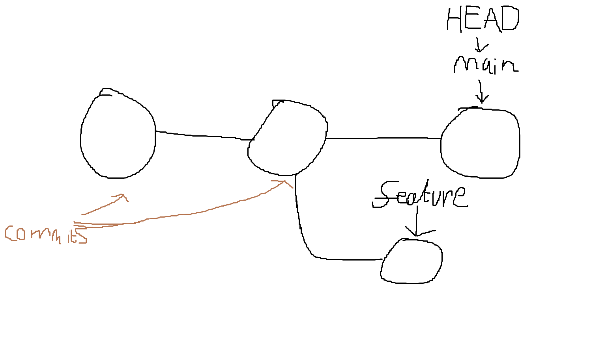

## Introduction
* Git is a distributed version control system
* Git =/= Github =/= Bitbucket

## Gitting around
* Basic commits
* Branching
	* HEAD, secret git folder
	
* .gitignore
* git log
* git diff
* git stash
* git revert, git reset
* Using remotes